

Trabajo práctico número 1 - Aprendizaje
Automático                                 
Grupo 12: Carrasco, Roel,
Sotelo

UNIVERSIDAD DE BUENOS AIRES

FACULTAD DE CS. EXACTAS Y NATURALES

MAESTRÍA EN EXPLOTACIÓN DE DATOS Y DESCUBRIMIENTO
DE CONOCIMIENTO

TRABAJO PRÁCTICO ENTREGABLE I  
Árboles de decisión

### 

### Aprendizaje Automático 

1er cuatrimestre de 2021

Grupo 12

Integrantes: Lisandro
Carrasco, Macarena Roel, Santiago
Sotelo

-----

### Resumen

## Poder clasificar el riesgo de sufrir un derrame cerebral de una persona a partir de información disponible y fácil de recolectar resulta de gran interés para la calidad de vida humana. 

## En este trabajo, se analizan los datos de 5.110 personas con resultados conocidos acerca de su padecimiento de un derrame cerebral o no, así como información sobre su edad, género, índice de masa corporal, estado civil, tipo de residencia y trabajo, y si tienen o no hipertensión, entre otras.

## A partir de aquello, se buscaron factores que podrían resultar de mayor interés a la hora de predecir un derrame cerebral. Para ello, se realizó un análisis exploratorio de los datos y se entrenaron varios árboles de clasificación con diferentes hiperparámetros y predictores, evaluando las diferencias en sus resultados.

## En función de las diferentes particiones hechas sobre la muestra, así como de los diferentes hiperparámetros utilizados, hemos notado cambios importantes en la performance de los modelos. Más allá de su variabilidad, valoramos haber logrado buenos resultados en métricas que eran de nuestro interés particular, principalmente recall y el F2 score.

## Como resultado, se obtuvo que las variables que mejor permiten discriminar entre quienes sufrieron derrames y quienes no fueron la edad, el índice de masa corporal y el nivel de glucosa en sangre. 

## Introducción

## Un derrame cerebrovascular puede ser causado cuando se rompe un vaso sanguíneo en o cerca del cerebro o cuando se interrumpe la irrigación de sangre y oxígeno al cerebro. Aunque se ha avanzado mucho en la detección y tratamiento de la enfermedad cerebrovascular, ésta sigue siendo una de las principales causas de muerte y discapacidad en muchos países del mundo (BBC News).  
Es por ello que resulta de gran interés encontrar métodos simples e interpretables para predecir el riesgo de padecer uno. 

## El objetivo de este trabajo fue generar el mejor árbol de clasificación posible para identificar pacientes con riesgo de sufrir derrames cerebrales a partir de información sobre su estado de salud y estilo de vida. Para ello se comenzó por realizar un análisis y limpieza de los datos disponibles, buscando las posibles variables de mayor interés. Las mismas se encuentran descritas en las secciones “Datos” y “Metodologías”, discutiendo los resultados obtenidos en “Resultados” y finalizando el trabajo con algunas valoraciones en la sección “Conclusiones”.

## Datos

Una breve descripción de las variables en cuestión y
sus diferentes valores. 

  - id. identificatoria
    de cada paciente. Si bien utiliza números, no deja de ser una
    variable nominal.
  - gender.
    Categórica, describe el género de la persona observada de manera
    binaria (hombre o mujer). También considera un caso no binario en la
    categoría 'otros'.
  - age.
    Numérica y continua. Si bien la mayoría de sus valores están
    discretizados por la edad en años, esto solo se cumple en los
    mayores de 2 años. En tanto a los menores de 2 años se los registra
    con mayor detalle, lo que hace que la variable sea continua.
  - hypertension.
    Es una variable binaria que evalúa si una persona tiene o no
    hipertensión. 
  - heart\_disease.
    Igual que la hipertensión, es una categórica dicotómica que evalúa
    si la persona tiene o tuvo alguna enfermedad cardíaca.
  - ever\_married.
    También es binaria, más allá de que el lugar de unos y ceros use
    'sí' y 'no'. Detalla si la persona está o estuvo alguna vez
    casada.

<!-- end list -->

  - work\_type.
    Variable categórica, no binaria, que clasifica el tipo de empleo de
    las personas observadas, y los etiqueta según si son empleados del
    sector privado, del sector público, si son cuentapropistas, si nunca
    trabajaron o si son niños.
  - Residence\_type divide
    a las personas entre habitantes de zonas urbanas o rurales.
  - abg\_glucose\_level.
    Numérica continua, registra el nivel de
    glucosa en
    sangre de las personas
    observadas.
  - bmi. Se trata
    del índice de masa corporal de las personas. Es la única variable
    con valores faltantes y no se puede imputar a partir de otras, pues
    requiere de variables tales como peso y altura, que no se encuentran
    disponibles. A su vez, presenta valores poco comunes por lo visto en
    la literatura médica.
  - smoking\_status.
    Clasifica de manera categórica entre actuales fumadores, ex
    fumadores o personas que nunca fumaron. Si bien no hay "formalmente"
    valores faltantes, hay una importante cantidad de registros -1544-
    que tienen registrado el valor "desconocido".
  - stroke. La
    variable objetivo. Apunta si la persona
    sufrió o
    no un accidente cerebrovascular.

La cuestión de los valores faltantes merece una
doble consideración. Por un lado, como ya se ha dicho, la única variable
que no tiene un valor asignado en una o varias filas, es decir, que
registra valores faltantes, es
bmi.  Sin
embargo, la variable
smoking\_Status registra
más de un cuarto de las observaciones bajo la categoría
unknown.
Esto implica que si bien tiene una asignación sobre un valor, es decir
que se puede contar como un valor "presente", en verdad no aporta
ninguna información sobre si esas personas son o han sido en algún
momento fumadoras.

En el caso de la variable bmi, debió considerarse que
no todos los valores observados eran valores comunes o posibles. Según
lo establecido por el NIH (National Heart, Lung and Blood Institute), la
tabla de índice de masa corporal comprende los valores entre 19 y 57;
sin embargo, la tabla no contempla a los niños (que sí están presentes
en el set de datos). Por otro lado, al realizar un boxplot, se pudo ver
que este método hace pensar que los valores mayores a 45 son outliers.
Esto se trataría de un caso de outlier de contexto: un caso que
normalmente no es extraño, pero en esta muestra puntual sí resulta
serlo. Ante estas dos consideraciones, se siguieron los valores de NIH,
por lo que se decidió eliminar las observaciones con valores menores a
10 (ninguna observación) y mayores a 57 (70 observaciones, de las cuales
sólo 1 había presentado derrames).  

Metodología 

Se comenzó por realizar un análisis exploratorio de las
variables y estudiar posibles correlaciones con la variable de interés
stroke. El número
total de casos que efectivamente había presentado un derrame era
bastante reducido (un total de 249, que representan un 4,87% de la
muestra) y
dificultaron la
observación de patrones que los
relacionaran, por lo que
se recurrió a generar tablas de doble entrada y gráficos de barras que
permitieran observar gráficamente el porcentaje de cada respuesta para
las distintas variables consideradas.  

Para adecuar las variables categóricas a los
requerimientos de los árboles de clasificación, se generaron
dummies para
todas las variables categóricas con más de dos niveles (género, tipo de
trabajo, y si son o no fumadores) y se codificaron las binarias con
label encoder (si
alguna vez se habían casado y tipo de residencia). En tanto para tratar
con los valores faltantes de la variable
bmi se
consideraron diferentes estrategias: eliminar los 201 casos faltantes,
entrenar un modelo KNN para imputarlas o realizar imputaciones por la
media agrupadas. Se optó por la última opción, agrupando por género y
cuartiles de edad para evitar aumentar el sesgo de la muestra. En el
caso de
smoking\_status, dado
el peso que tienen los desconocidos para el total del dataset, se
decidió mantenerlos todos. 

Más allá de las consideraciones hechas respecto de la
mayor correlación de variables tales como edad, nivel de glucosa o el
índice de masa corporal, se decidió entrenar los árboles con todas las
variables disponibles. Sobre el final del trabajo, recurrimos
a RFE para reducir las
dimensiones utilizadas en función de la importancia presentada por cada
una en árboles anteriores. 

Como se mencionó previamente, el conjunto de datos se
encontraba fuertemente desbalanceado, con muchos más casos negativos que
positivos. Ante esto, se utilizaron dos estrategias para reducir su
impacto: por un lado, las divisiones de muestras consideraron el
parámetro
stratify, para
asegurar que los conjuntos a utilizar
contuvieran datos de
strokes positivos; por otro lado, cada árbol utilizó el hiperparámetro
class\_weight con
el argumento
‘balanced’,
que agrega un peso para medir la impureza en
función de cuán desbalanceados están los datos. 

Como métrica principal se utilizó
Fβ-Score con un
 valor de 2 para β, buscando darle un mayor peso al
recall, pero sin
dejar de lado la accuracy. En este sentido,
también se le prestó una importante atención a la medida de recall,
entiendo la importancia de la sensibilidad de detectar casos que pueden
ser cuestiones de vida o muerte.

En cuanto a los modelos, se han entrenado árboles con
varias profundidades (evitando superar una profundidad de 10 para no
caer en grandes sobreajustes), diferentes estrategias de muestreo y de
poda, utilizando divisiones de sets de validación con varias semillas o
con StratifiedKFold
de
GridSearchCV, así
como diferentes niveles de α para la post poda. Tanto los árboles
entrenados sin poda con GridSearchCV así como los árboles podados, se
evaluaron en los sets de validación y de prueba, graficando sus
resultados con boxplots y matrices de confusión.

Resultados 

Si bien el desbalance y la poca presencia de casos con
strokes
dificultó establecer
correlaciones, así como la presencia de múltiples variables categóricas
redujo la dimensión del correlograma, destacamos que la variable que más
correlación presenta con la posibilidad o no de sufrir una lesión es la
edad. Si bien presenta una baja correlación lineal (0,245),
la misma no parece ser la adecuada en este
caso, ya que es la variable más importante
(posteriormente, se ha visto como principal discriminante en los
árboles). El nivel de glucosa en sangre ha resultado ser la segunda
variable más correlacionada. (Anexo I)  
También se realizaron gráficos comparativos entre las variables
categóricas y los casos de strokes, donde se comparó la proporción de
cada clase que había sufrido o no un accidente. La distribución de
hombres y mujeres que presentaron strokes fue prácticamente idéntica a
la que no, así como tampoco se presentaron grandes diferencias según los
lugares de residencias.  
Por otro lado, sí hubo importantes desproporciones en las variables de
hipertensión y enfermedades cardíacas; siendo las personas que padecían
estas enfermedades más propensas a sufrir una lesión; mientras que las
personas que están o estuvieron casadas presentaron menos casos. (Anexo
II)  
Dos datos muy llamativos se han presentado en las variables de
fumadores y de
tipos de trabajos:
la proporción de los ex fumadores que presentaron casos es bastante más
elevada que la de los que no presentaron, esta diferencia intraclase es
aún más amplia que la que presentaron los fumadores. En un segundo
punto, también se aprecia una diferencia notable en la ocurrencia de
casos según el tipo de empleos, siendo la proporción de empleados en el
sector público y privado muy similar ante los strokes, pero con los
cuentapropistas mucho más afectados que en los otros
casos (Figura 1).

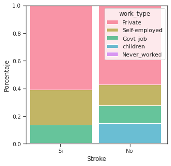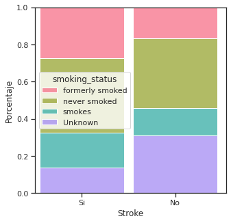

Figura
1: gráficos
de barras porcentuales de las variables tipo de trabajo y fumadores,
divididas según derrame o no y coloreadas según los valores que
tomaron.

Se han entrenado 3 árboles, uno con 50 conjuntos de
validación generados por 50 semillas distintas; otro utilizando Cross
Validation con 50 folds que
respetaran las
proporciones de casos objetivos y, finalmente, un árbol con diferentes
niveles de α.

En términos generales, se obtuvieron buenos resultados
en una de las métricas más importantes,
recall, tanto sobre
el set de validación como el de prueba. Sin embargo, la performance
asociada al score F2 ha sido considerablemente menor, dado que el
accuracy de los tres modelos fue considerablemente bajo. Por otro lado,
también se observó una diferencia de rendimiento cuando los modelos se
evaluaban sobre los sets de validación o los de testeos, siendo en el
segundo caso algo menor y dando un indicio de sobreajuste a los datos de
entrenamiento. 

En términos puntuales, el árbol entrenado con
validación cruzada ha presentado mejores resultados que el árbol
entrenado con 50 conjuntos de validación definidos por semillas
distintas. Si bien ambos presentaron medianas de 0,34 en lo que respecta
a la métrica de F2, el árbol entrenado con CV alcanzó mejores resultados
máximos, con scores de hasta 0.71, mientras que el primero no superó el
0,5. Los boxplots de ambos árboles se encuentran
en el anexo (Anexo III).  
El árbol que mejores resultados presentó bajo la estrategia de Grid
Search, contó con una profundidad de 4, un
alpha de 0,  una
cantidad de hojas mínima de 1 y utilizó el criterio de entropía. Las
variables que han resultado de mayor importancia para generar sus
divisiones han sido la variable de edad (por mucho, la más importante y
presente en los primeros tres nodos), el nivel de glucosa en sangre y el
índice de masa corporal. Puede verse el árbol entero en el anexo (Anexo
IV).

Los mejores resultados
totales los ha presentado el árbol podado, tanto
sobre validación como sobre testeo. Se atribuye esta mejora considerable
a la reducción del sobreajuste de los modelos anteriores al set de
entrenamiento. El árbol podado fue entrenado con una estrategia de
Random Search y presentó una profundidad máxima de 2, un α de 0,1315 y
utilizó el criterio de entropía.  
Evaluando sobre el set de testeo, presentó
un nivel de recall de 0,92, siendo muy superador
del árbol sin poda, que alcanzó un 0,68. De los 50 casos que se le
presentaron y que efectivamente habían sufrido accidentes, el árbol
podado pudo identificar a 46, mientras que el árbol sin poda solo
detectó 36 de los casos. Las matrices de confusión pueden verse en el
anexo (Anexo V).

Para evaluar el efecto de los diferentes niveles de
poda, se realizó un gráfico comparativo entre los resultados generados
por múltiples valores de este hiperparámetro. Si bien está planteado
sobre el accuracy y no sobre nuestras métricas principales, puede
evaluarse claramente como un mayor nivel de
α mejora la métrica sobre el set de testeo y la reduce sobre el de
entrenamiento y el de validación, hasta llegar a
un punto en que se encuentran y este efecto se estabiliza. Puede verse
este gráfico en el anexo (Anexo VI). 

Finalmente, se analizó la importancia que aportó cada
variable al árbol entrenado con validación cruzada. Como podía
visualizarse en las divisiones del árbol, la edad ha sido el descriptor
de mayor importancia, seguida por el nivel de glucosa y el índice de
masa corporal; en tanto el árbol no ha considerado ninguna otra variable
como importante y estas tres concentraron toda la importancia, con
niveles de 0,7877, 0,16422 y 0,04801, respectivamente. Luego de revisar
estos valores, se volvió a entrenar el árbol haciendo uso de la técnica
de eliminación recursiva, utilizando la herramienta
RFE  de scikit
learn. Tanto al reducir las variables a 3 como a 4, los resultados de
las métricas se han mantenido inalterables, tanto evaluando sobre el
test de validación como el de prueba, mostrando así la importancia
excluyente de la edad, el nivel de glucosa y el bmi como descriptores.

Conclusión

En este trabajo, se realizó un proceso desde el
análisis de los datos “crudos” hasta la creación de un árbol de
decisión con validación y poda, pasando por el preprocesamiento y el
análisis de posibles correlaciones. En el camino, debieron
tomarse
diversas decisiones que fueron afectando el
posible resultado a obtener, como el método de imputación de datos
faltantes, las métricas a priorizar, y el tratamiento de variables
categóricas, así como la selección de features a utilizar para la
creación de los árboles y la selección de hiperparámetros.

El principal limitante del trabajo ha sido la baja
proporción de casos positivos en el dataset original. Esto dificultó
seriamente la eficiencia de los modelos y, si bien se utilizaron
diferentes estrategias para un correcto balanceo en los conjuntos de
datos y en los pesos del modelo, esta cuestión pudo apreciarse en
algunos niveles bajos en las métricas evaluadas. 

Aún así, resaltamos que fue posible identificar las
variables que mejor
permitieron predecir el
riesgo de derrame: edad, índice de masa corporal y glucosa en sangre.
Pero, principalmente, destacamos haber logrado
un alto nivel de
sensibilidad para detectar potenciales casos de
strokes, gracias al aporte de la estrategia de poda, incluso en los
datos de testeo.

A pesar de contar con espacio para mejoras,
consideramos que este método permite un buen primer análisis del riesgo
de derrame cerebral que corre una persona, además de proveer una idea
general de qué factores podrían cambiarse para reducir el mismo.

-----

### Anexos

#### Anexo I

<table>
<colgroup>
<col style="width: 33%" />
<col style="width: 33%" />
<col style="width: 33%" />
</colgroup>
<tbody>
<tr class="odd">
<td><h3 id="h.dgw2wnirdtvk" class="c4">stroke</h3></td>
<td><h3 id="h.dgw2wnirdtvk-1" class="c4">No Stroke     </h3></td>
<td><h3 id="h.dgw2wnirdtvk-2" class="c4">Stroke</h3></td>
</tr>
<tr class="even">
<td><h3 id="h.dgw2wnirdtvk-3" class="c4">Promedio BMI</h3></td>
<td><h3 id="h.dgw2wnirdtvk-4" class="c4">28.527915  </h3></td>
<td><h3 id="h.dgw2wnirdtvk-5" class="c4">30.471292</h3></td>
</tr>
<tr class="odd">
<td><h3 id="h.dgw2wnirdtvk-6" class="c4">Promedio Edad</h3></td>
<td><h3 id="h.dgw2wnirdtvk-7" class="c4">41.760451  </h3></td>
<td><h3 id="h.dgw2wnirdtvk-8" class="c4">67.712919</h3></td>
</tr>
<tr class="even">
<td><h3 id="h.dgw2wnirdtvk-9" class="c4">Promedio Glucosa en sangre</h3></td>
<td><h3 id="h.dgw2wnirdtvk-10" class="c4">104.003736 </h3></td>
<td><h3 id="h.rqq425qnuu32" class="c4">134.571388</h3></td>
</tr>
</tbody>
</table>

   Tabla 1: medias de las
variables numéricas para cada grupo

### 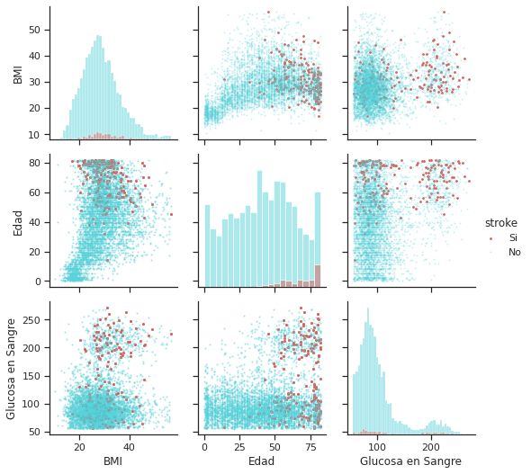

Figura 2: histogramas y distribución de puntos para
las variables numéricas, coloreadas según la presencia de
derrame.

#### Anexo II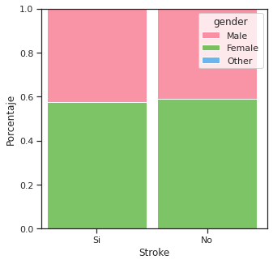

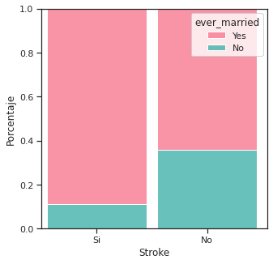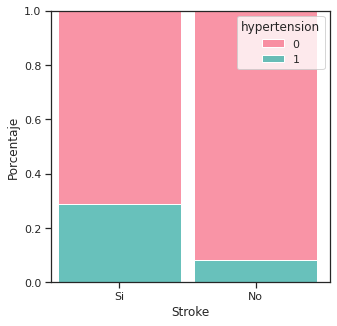

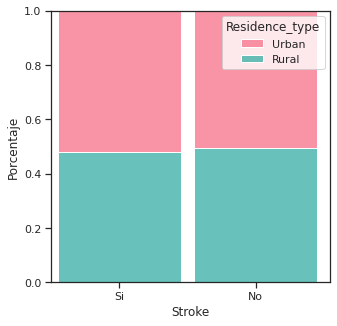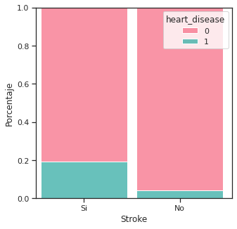

Figuras 3 a 7: gráficos de barras porcentuales de
las variables categóricas, divididas según derrame o no y coloreadas
según los valores de la variable categórica: género, hipertensión si
alguna vez se casaron, tipo de residencia y enfermedad cardíaca

Anexo III

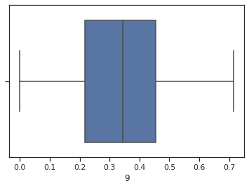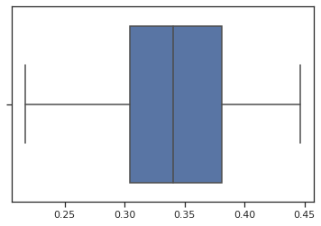

Figuras 8 y 9: Boxplots del árbol de semillas
(izquierda), y árbol de validación cruzada (derecha)

Anexo IV

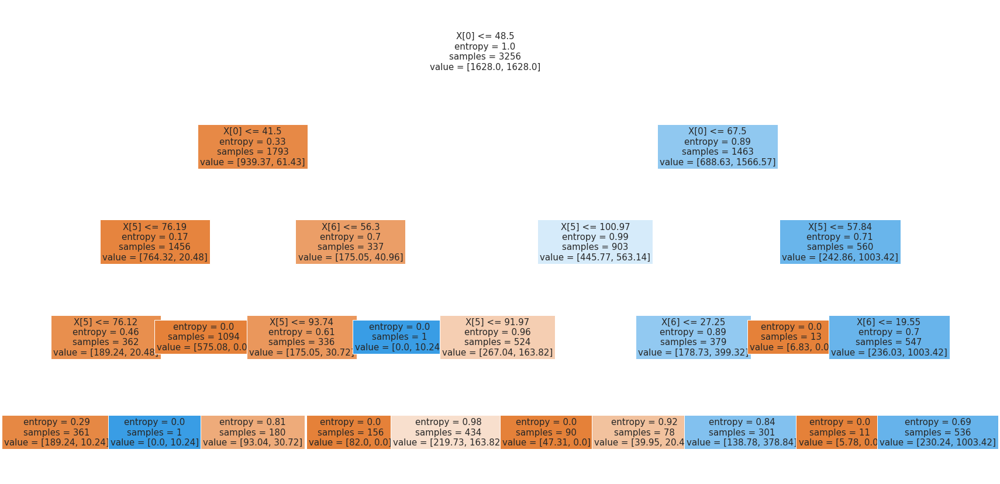

Figura 10: Árbol con mejores resultados

Anexo V

### 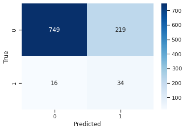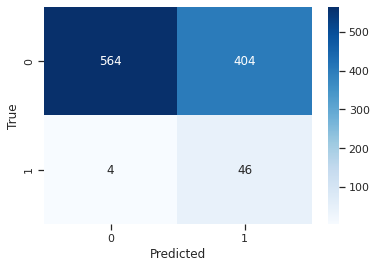

### Figuras 11 y 12:

Izquierda:  
Árbol sin podar sobre test  
Recall del árbol sin podar: 0.68  
F2 del árbol sin podar: 0.37527593818984545  
Accuracy del árbol sin podar: 0.769155206286837

Derecha:  
Árbol podado sobre test  
Recall del árbol podado: 0.92  
F2 del árbol podado: 0.35384615384615387  
Accuracy del árbol podado: 0.5992141453831041

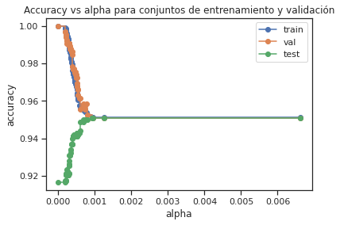

Figura 13: Accuracy vs alpha en conjuntos de
entrenamiento y validación

### 

### 

### 

### Bibliografía

BBC News. (2012, 05 09). Un
dibujo puede mostrar el riesgo de un derrame
cerebral. BBC News Mundo. Retrieved 05 22, 2021,
from
https://www.bbc.com/mundo/noticias/2012/05/120509\_prueba\_dibujo\_derrame\_cerebral\_men

NIH (National Heart, Lung and Blood Institute). (2021).
Body Mass Index
Table. NIH Body Mass Table. Retrieved 05 15,
2021, from
https://www.nhlbi.nih.gov/health/educational/lose\_wt/BMI/bmi\_tbl.htm

sklearn documentation.
sklearn Decision Tree
Classifier. scikit learn.
https://scikit-learn.org/stable/modules/generated/sklearn.tree.DecisionTreeClassifier.html

sklearn documentation.
sklearn metrics fbeta
score. Scikit Learn.
https://scikit-learn.org/stable/modules/generated/sklearn.metrics.fbeta\_score.html

sklearn documentation.
Sklearn Post Cost Complexity
Pruning. scikit learn.
https://scikit-learn.org/stable/auto\_examples/tree/plot\_cost\_complexity\_pruning.htm

sklearn documentation.
Sklearn RFE. scikit
learn.
https://scikit-learn.org/stable/modules/generated/sklearn.feature\_selection.RFE.html

